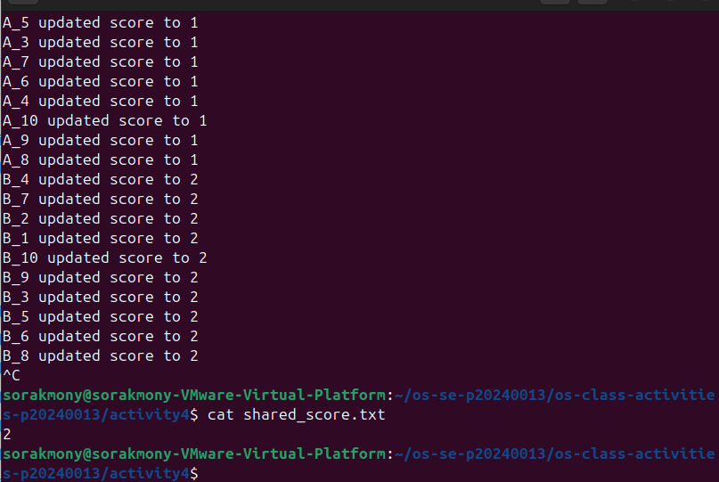
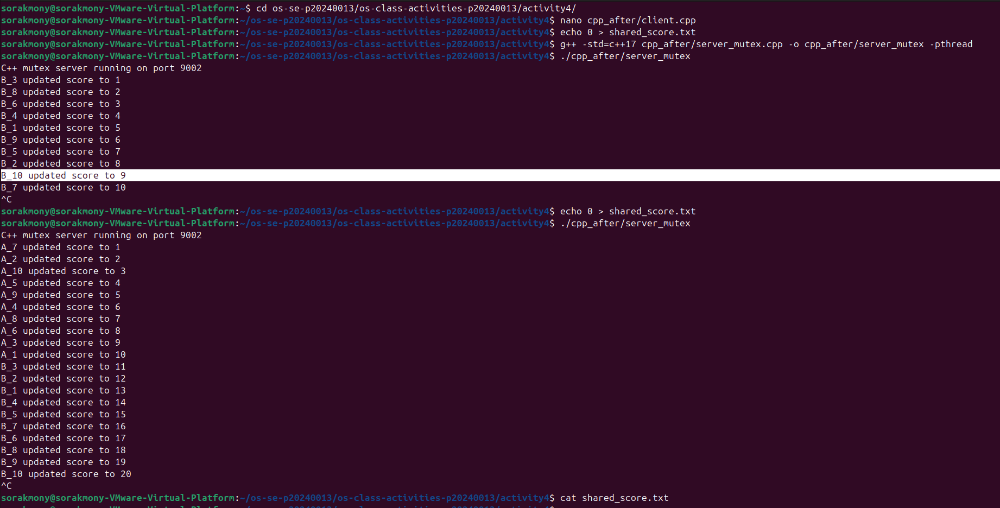
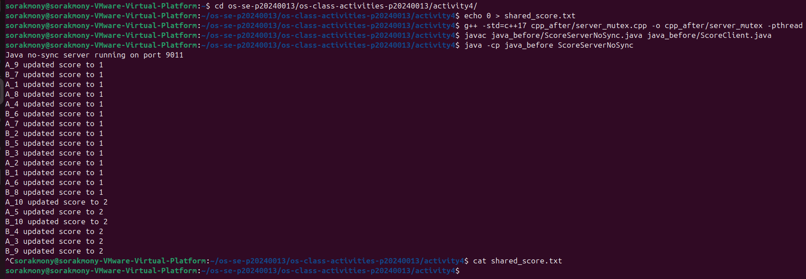
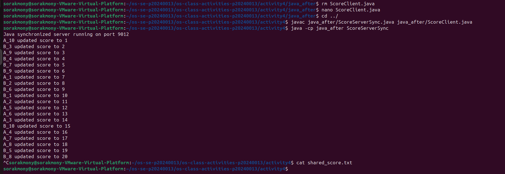

# Class Activity 4 — Shared File API

- **Student Name:** MI Sorakmony
- **Student ID:** p20240013
- **Partner Name:** Chum Kimchhun
- **Partner Student ID:** p20240067
- **Server Machine Owner:** sorakmony
- **Server IP Address:** 192.168.204.332

---

## Task 1: C++ Before Mutex

- Expected score after 20 total client requests: 20
- Actual score: 16
- What happened:
The final score was less than 20 because multiple threads updated the shared file at the same time without synchronization. Some updates were overwritten due to a race condition.

---

## Task 2: C++ After Mutex

- Expected score after 20 total client requests: 20
- Actual score: 20
- What changed after adding mutex:
After adding `std::mutex`, only one thread could access the critical section at a time. This prevented race conditions and ensured all updates were correctly written to the file.

---

## Task 3: Java Before Synchronized

- Expected score after 20 total client requests: 20
- Actual score: 17
- What happened:
The Java server created multiple threads for clients, but the shared file update was not synchronized. Multiple threads accessed the file simultaneously, causing lost updates.

---

## Task 4: Java After Synchronized

- Expected score after 20 total client requests: 20
- Actual score: 20
- What changed after adding synchronized:
The `synchronized` keyword ensured that only one thread executed the `updateScore()` method at a time. This protected the shared file and prevented race conditions.

---

## Questions

1. Why should clients send requests to the server instead of writing the file directly?

Clients should send requests to the server because the server centralizes file access and controls updates to the shared file. This reduces file corruption and improves consistency.

2. Why does the server still have a race condition before mutex or synchronized?

The server handles multiple clients using threads. Without synchronization, several threads may read and write the shared file at the same time, causing race conditions and lost updates.

3. In the C++ fixed version, what does `std::lock_guard<std::mutex>` protect?

`std::lock_guard<std::mutex>` protects the critical section that reads, increments, and writes the shared score file.

4. In the Java fixed version, what does `synchronized` protect?

`synchronized` protects the `updateScore()` method so that only one thread can execute it at a time.

5. Why is the final score expected to be 20 when Student A sends 10 requests and Student B sends 10 requests?

Each request increases the score by 1. Student A sends 10 requests and Student B sends 10 requests, so the total expected increase is 20.

6. What could happen if two separate servers update the same file at the same time?

The file may become inconsistent or corrupted because both servers could overwrite each other’s updates. Some increments might be lost.

---

## Reflection

This activity demonstrated the importance of synchronization when multiple threads access shared resources. In C++, synchronization was implemented using `std::mutex` and `std::lock_guard`, while Java used the `synchronized` keyword. Both methods ensured that only one thread updated the shared file at a time. The activity helped us understand how race conditions occur and why synchronization is necessary in multithreaded server applications.
