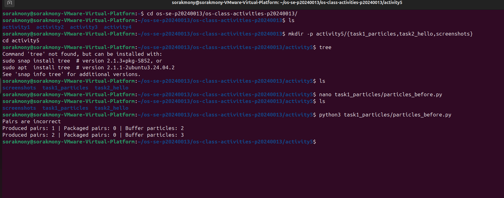
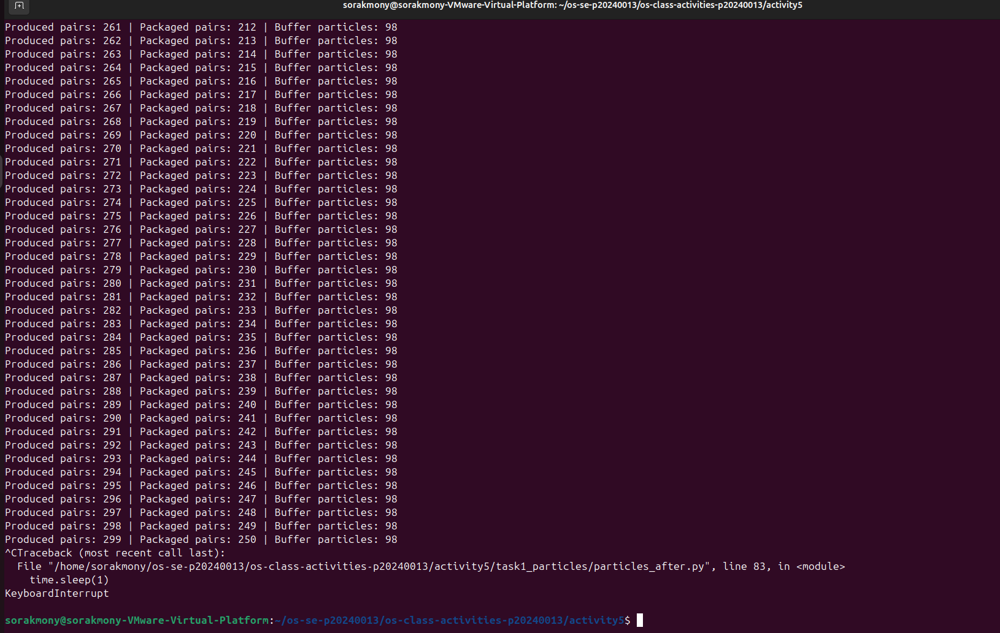

# Class Activity 5 - Semaphores

* **Student Name:** MI Sorakmony
* **Student ID:** p20240013
* **Programming Language Used:** Python

---

## Task 1A: Particle Pair Buffer Before Semaphores



### What error or incorrect behavior appeared

The program displayed **"Pairs are incorrect"** when the consumer removed two particles that did not belong to the same pair.

### Why did this happen without semaphore protection

Without semaphores, multiple producer threads could access the shared buffer simultaneously. This caused race conditions where particles from different pairs became mixed together in the buffer, resulting in incorrect packaging.

---

## Task 1B: Particle Pair Buffer After Semaphores



### Number of producer machines

3 producer threads

### Buffer capacity

100 particles (50 particle pairs)

### Semaphores used

* `empty_pairs` (initial value = 50)
* `full_pairs` (initial value = 0)
* `mutex` (initial value = 1)

### Produced pair count shown in screenshot

Replace with the value visible in your screenshot.

### Packaged pair count shown in screenshot

Replace with the value visible in your screenshot.

### Did any error appear during normal operation?

No. The simulation continued running normally without displaying any error messages.

---

## Task 2A: HELLO Before Semaphores


### Output before semaphore ordering

Example output:

```text
LOHEL
```

### Why this output can be wrong or unpredictable

The threads run concurrently and the operating system scheduler determines their execution order. Since there is no synchronization, the letters may appear in different orders each time the program runs.

---

## Task 2B: HELLO After Semaphores


### Processes or threads used

3 threads

### Semaphores used

* `after_e`
* `after_l2`

### Final output

```text
HELLO
```

---

# Questions

## 1. In Task 1, why does a producer need to wait before adding a pair to the buffer?

A producer must wait until enough space is available in the buffer. Since each particle pair occupies two consecutive slots, adding a pair when the buffer is full would exceed the buffer capacity and cause incorrect behavior.

## 2. In Task 1, why does the consumer need to wait before removing a pair from the buffer?

The consumer must wait until a complete pair is available. Removing particles from an empty or incomplete buffer would cause invalid operations and incorrect results.

## 3. Which semaphore protects the critical section in your particle buffer program?

The `mutex` semaphore protects the critical section by ensuring that only one thread can access and modify the shared buffer at a time.

## 4. How does your program verify that P1 and P2 belong to the same pair?

Each particle contains a machine ID and pair ID in its name, such as `M2-17-P1` and `M2-17-P2`. The consumer compares the machine ID and pair ID portions of both particles. If they do not match, the program prints **"Pairs are incorrect"**.

## 5. In Task 2, why can the program print letters in the wrong order without semaphores?

Without semaphores, threads execute independently and concurrently. The operating system decides which thread runs first, causing letters to appear in unpredictable orders.

## 6. Which semaphore or synchronization step forces H to print before E, L, L, and O?

Process 1 prints `H` and `E` first and then signals the `after_e` semaphore. Process 2 waits on `after_e` before printing the two `L` characters. Process 3 waits on `after_l2` before printing `O`. This guarantees the output order `HELLO`.

## 7. What could cause deadlock in either of your simulations?

Deadlock could occur if a thread acquires a semaphore but never releases it, causing other threads to wait forever. It could also happen if multiple threads wait for resources held by each other, creating a circular dependency.

---

# Reflection

These simulations demonstrated how semaphores are used to coordinate concurrent threads and protect shared resources. In the particle buffer simulation, semaphores prevented race conditions and ensured that producers and consumers accessed the buffer safely. In the HELLO simulation, semaphores enforced the correct execution order among threads. Overall, semaphores are an important synchronization mechanism for maintaining correctness and preventing concurrency-related errors in multithreaded systems.
