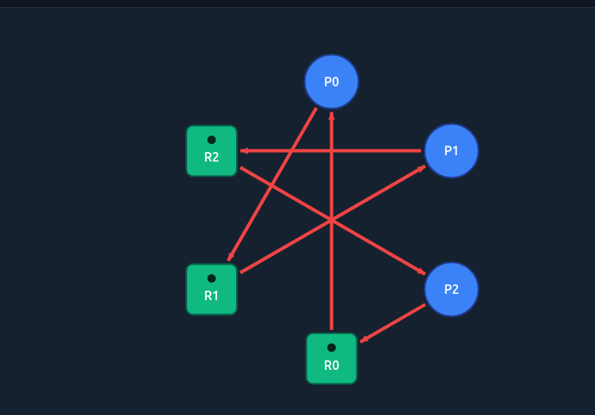
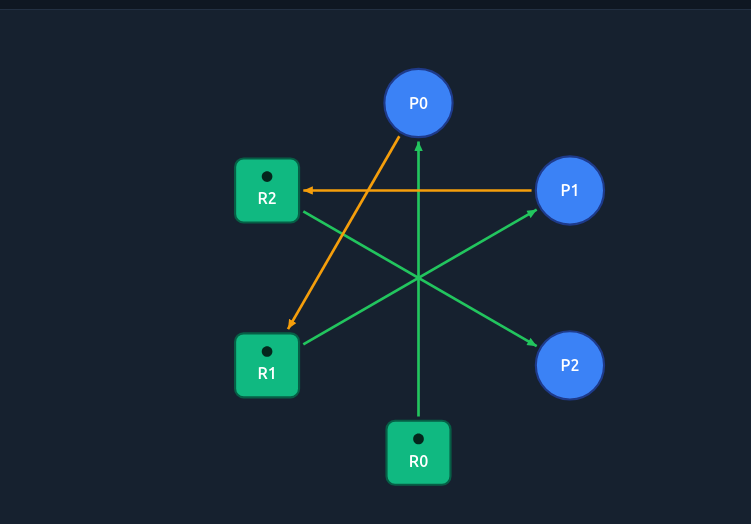
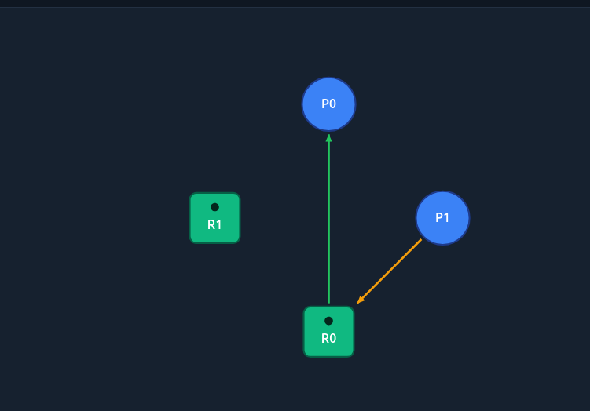
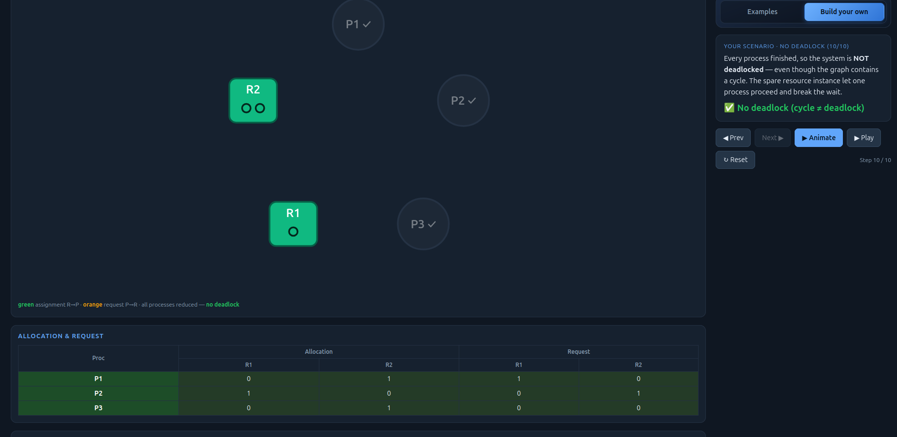
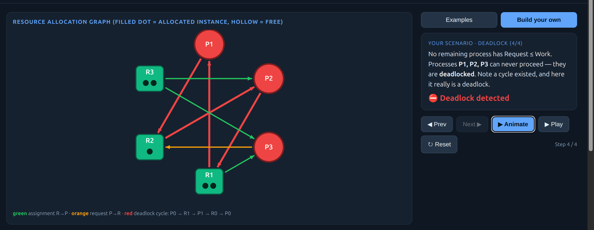
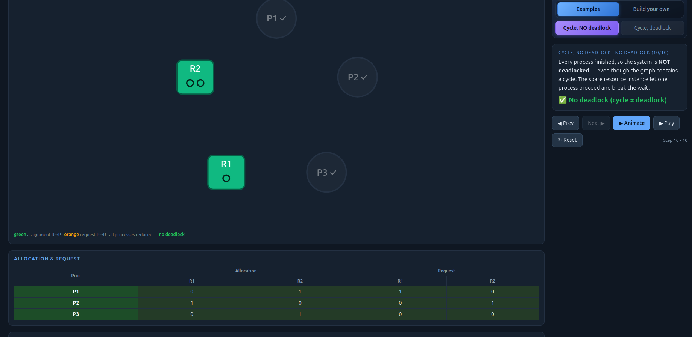
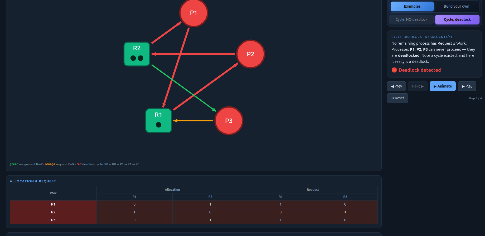

# Class Activity 7 - Reasoning About Deadlock

- **Student Name:** MI Sorakmony
- **Student ID:** p20240013
- **Personalization:** a = 2, b = 0 → Max[P0][A] = 9, Max[P2][C] = 2

---

## Task 1 — Resource Allocation Graphs

### Part A

**Graph 1 — prediction:** Cycle exists: `P0→R1→P1→R2→P2→R0→P0`. Every process holds one resource and waits for the next — no one can proceed. **DEADLOCKED.**


Matched tool? Yes.

**Graph 2 — prediction:** No cycle. P2 holds R2 but makes no request → P2 finishes first, releases R2 → unblocks P1 → unblocks P0. Finish order: P2→P1→P0. **NOT deadlocked.**


Matched tool? Yes.

### Part B

**(i) Deadlocked 3×3:** P0 → R2 → P1 → R0 → P2 → R1 → P0. Each resource is held by one process and requested by the next, forming an unbreakable circle through all three processes.


**(ii) No-cycle (4 nodes, 1 request):** P0 → R2 → P1 → R0 → P2 → R1 . No cycle can form.



---

## Task 2 — Cycle ≠ Deadlock

**Warm-up:**
1. "Cycle, NO deadlock": one resource has a spare instance. The process that receives it finishes first, releasing its allocation and unravelling the cycle.
2. Single change: removing the spare instance (reducing count to 1) means no process can get enough resources — the cycle becomes a true deadlock.

### Part A — given scenario

```
            Allocation       Request        Total
            R1  R2  R3       R1  R2  R3
P1           1   0   0        0   1   0      R1=2
P2           0   1   1        1   0   0      R2=1
P3           1   0   1        0   0   0      R3=2
```

**Available = Total − ΣAlloc:**
- R1: 2−(1+0+1) = **0**
- R2: 1−(0+1+0) = **0**
- R3: 2−(0+1+1) = **0** → Available = [0,0,0]

**Cycle:** P1→R2→P2→R1→P1. P3 holds R1 (which P2 needs) but makes no request — P3 can finish first.

**Reduction:**

| Step | Process | Why Request ≤ Work | Work after release |
|------|---------|--------------------|--------------------|
| 1 | P3 | [0,0,0] ≤ [0,0,0] ✓ | [0,0,0]+[1,0,1] = **[1,0,1]** |
| 2 | P2 | [1,0,0] ≤ [1,0,1] ✓ | [1,0,1]+[0,1,1] = **[1,1,2]** |
| 3 | P1 | [0,1,0] ≤ [1,1,2] ✓ | [1,1,2]+[1,0,0] = **[2,1,2]** |

**NOT deadlocked.** Order: P3→P2→P1.



**One change → deadlock (P3 request → [0,1,0]):** Available is still [0,0,0]. Now P3 also needs R2 → no process has Request ≤ [0,0,0]. P3 was the only process that could start the reduction chain (its request was [0,0,0]). Removing that means Work never grows — system is fully stuck. **DEADLOCKED.**



### Part B — own scenario

```
            Allocation    Request     Total: R1=2, R2=1
            R1  R2        R1  R2
P1           1   0         0   1
P2           0   1         1   0
P3           1   0         0   0
```
Available = [0,0]. Cycle: P1→R2→P2→R1→P1. But P3 holds R1 with no request → P3 finishes → releases R1 → P2 unblocks → P2 releases R2 → P1 unblocks. **NOT deadlocked.**



**One change → deadlock:** Change P3's request to [0,1]. Now P3 also blocks on R2. No process can satisfy Request ≤ [0,0] — the reduction never starts. **DEADLOCKED.**



---

## Task 3 — Banker's Algorithm

**Max[P0][A] = 7+(2 mod 3) = 9 | Max[P2][C] = 2+(0 mod 4) = 2**

| | Alloc A B C | Max A B C | Need A B C |
|--|-------------|-----------|------------|
| P0 | 0 1 0 | 9 5 3 | **9 4 3** |
| P1 | 2 0 0 | 3 2 2 | **1 2 2** |
| P2 | 3 0 2 | 9 0 2 | **6 0 0** |

**Available = [10,5,7] − [5,1,2] = [5,4,5]**

**Safety trace (Work starts at [5,4,5]):**

| Step | Process | Why Need ≤ Work | Work after release |
|------|---------|-----------------|---------------------|
| 1 | P1 | [1,2,2] ≤ [5,4,5] ✓ | [5,4,5]+[2,0,0] = **[7,4,5]** |
| 2 | P2 | [6,0,0] ≤ [7,4,5] ✓ | [7,4,5]+[3,0,2] = **[10,4,7]** |
| 3 | P0 | [9,4,3] ≤ [10,4,7] ✓ | [10,4,7]+[0,1,0] = **[10,5,7]** |

**SAFE — safe sequence = ⟨P1, P2, P0⟩**


Matched tool? Yes.

**Request GRANTED — P1 requests [1,0,2]:**
1. [1,0,2] ≤ Need[P1]=[1,2,2] ✓
2. [1,0,2] ≤ Available=[5,4,5] ✓
3. Tentative Available=[4,4,3] → safety check gives ⟨P1,P2,P0⟩ ✓ → **GRANTED**


**Request DENIED — P0 requests [5,0,0]:**
1. [5,0,0] ≤ Need[P0]=[9,4,3] ✓
2. [5,0,0] ≤ Available=[5,4,5] ✓
3. Tentative Available=[0,4,5] → P1 needs A=1>0, P2 needs A=6>0, P0 needs A=4>0 — no process can proceed → **UNSAFE → DENIED**


---

## Task 4 — Semaphores and Deadlock

**Case 1 (s1=s2=s3=1) — NO**

P1 acquires s1→s2, P2 acquires R2→R3, P3 acquires R1-R2→R3. All three follow the **same ascending order** (R1 before R2 before R3). A circular wait requires at least one process to acquire a lower-numbered semaphore after a higher-numbered one — none do, so no cycle can form.


Tool confirmed: no cycle.

**Case 2 (s1=s2=s3=1) — YES**

P3 now acquires s2→s3→s1 — reversed order. Dangerous interleaving:
1. P1 holds s1, blocks on s2
2. P3 holds s2, holds s3, blocks on s1

Wait-for cycle: **P1→s2→P3→s1→P1** → DEADLOCK.

Snapshot: R1→P1, P1→R2, R2→P3, R3→P3, P3→R1, P2→R2.


Tool confirmed: cycle detected.

**Case 3 (s1=2, s2=s3=1) — NO**

Same code as Case 2. When P3 reaches `wait(R1)`, R1 still has one spare instance (P1 holds 1 of 2). P3 gets R1, completes, releases everything — the cycle from Case 2 never closes. The extra instance of R1 prevents P3 from ever blocking at `wait(s1)`.


Tool confirmed: not deadlocked.

---

## Task 5 — Applied Concepts

**1.** Four conditions using a kitchen (two chefs, one knife + one cutting board):
- **Mutual exclusion:** only one chef uses the knife at a time.
- **Hold and wait:** Chef A holds the knife while waiting for the board.
- **No preemption:** the board can't be forcibly taken from Chef B.
- **Circular wait:** A waits for B's board; B waits for A's knife.

Easiest to remove: **circular wait** — enforce a rule that every chef always grabs the knife first, then the board. Cost: slight inconvenience in ordering; no physical changes needed.

**2.** In a single-instance RAG, a cycle means the one held instance is exactly what each waiting process needs — no alternative exists, so deadlock is guaranteed. In a multi-instance system, a spare instance of a resource in the cycle can satisfy a waiting process, allowing it to finish and release its holdings, breaking the cycle.

**3.** A deadlocked state means processes are *already* permanently blocked. An unsafe state means the OS cannot guarantee all processes will finish — deadlock is possible but not yet certain. Example: P1 holds A=3 and needs 2 more; P2 holds A=2 and needs 3 more; Available=0. Neither is blocked yet, but if both request simultaneously, the system deadlocks.

**4.**

| | Banker's (avoidance) | Detection + recovery |
|--|---|---|
| Cost | Requires max-demand declarations; runs safety check on every request; lower resource utilization | Recovery disrupts work (rollback/kill); detection scan adds CPU overhead |
| Best for | Database systems with known lock counts per transaction | General-purpose OSes / batch systems where rollback is acceptable |

**5.** The safety algorithm simulates the worst-case future — it must know the maximum demand to check whether a safe completion sequence exists. Without it, the OS can't tell if a request leaves the system unsafe. Real-world problem: most processes don't know their max resource needs in advance (a web request's memory use depends on user input). This forces over-estimation (wasting resources) or makes Banker's impractical, which is why it isn't used in general-purpose OSes.

---

## Reflection

This activity showed that a cycle is only *evidence* of deadlock in single-instance systems — in multi-instance systems, a spare instance acts as a release valve, letting one process complete and unravel the cycle. The Banker's Algorithm trades resource utilization for safety guarantees, which works in theory but breaks down when processes can't declare their maximum needs. Detection + recovery accepts that deadlocks will happen and fixes them after the fact — a pragmatic choice for systems like databases, which can abort one transaction cheaply to free the rest.
