# OS Lab 6 Submission — Linux Security, Users, Groups & File Permissions

- **Student Name:** MI Sorakmony
- **Student ID:** p20240013

---

## Task Output Files

Make sure all of the following files are present in your `lab6/` folder:

- [ ] `task1_users.txt`
- [ ] `task2_groups.txt`
- [ ] `task3_permissions.txt`
- [ ] `task3_stat_output.txt`
- [ ] `task4_special_bits.txt`
- [ ] `task5_acl.txt`
- [ ] `security_lab/whoami_suid.c`

---

## Screenshots

Insert your screenshots below.

### Screenshot 1 — Task 1: User Creation
Show `cat task1_users.txt` confirming both `dev_alice` and `dev_bob` accounts exist.
<!-- Insert your screenshot below: -->
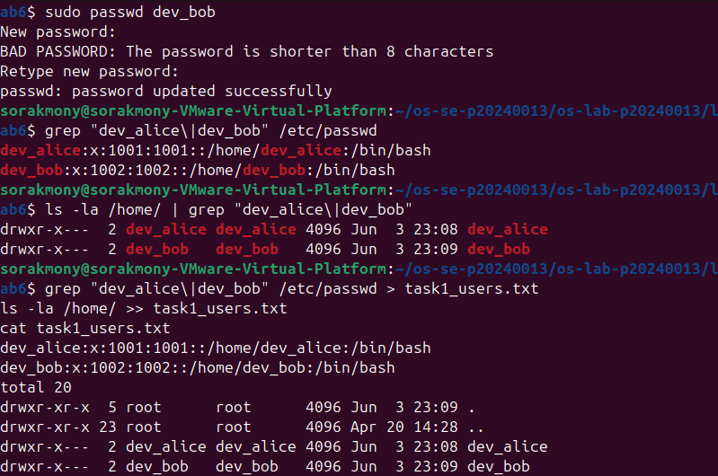

---

### Screenshot 2 — Task 1: User Modification
Show the updated `/etc/passwd` entry for `dev_alice` with the GECOS comment field.
<!-- Insert your screenshot below: -->
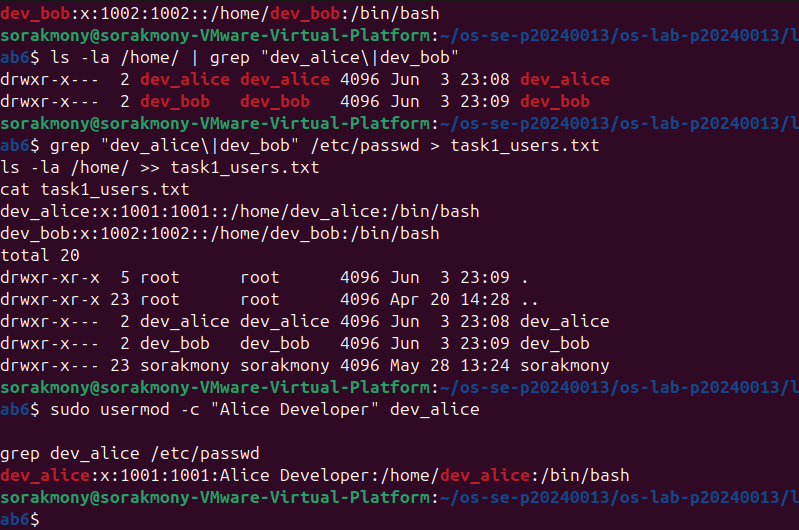

---

### Screenshot 3 — Task 2: Group Setup
Show `cat task2_groups.txt` with group membership for both users.
<!-- Insert your screenshot below: -->
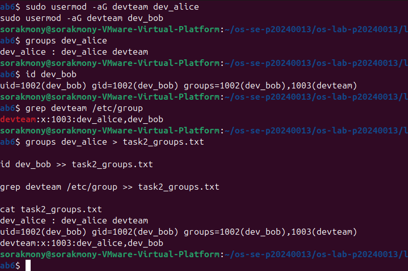

---

### Screenshot 4 — Task 2: Multiple Group Membership
Show `id dev_alice` confirming membership in both `devteam` and `auditors`.
<!-- Insert your screenshot below: -->
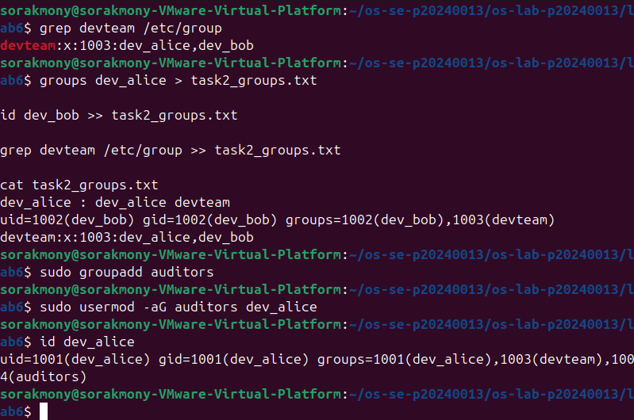

---

### Screenshot 5 — Task 3: Directory Permissions
Show `cat task3_permissions.txt` with `drwxrwx---` on the project directory.
<!-- Insert your screenshot below: -->
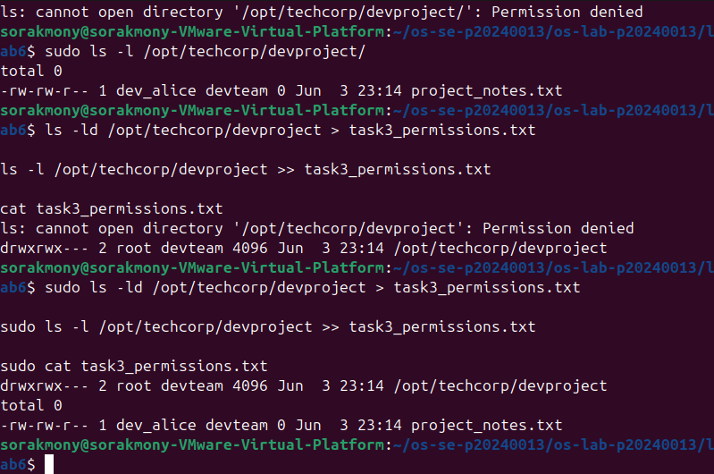

---

### Screenshot 6 — Task 3: Access Denied
Show the `Permission denied` error when `temp_user` tries to access the project directory.
<!-- Insert your screenshot below: -->
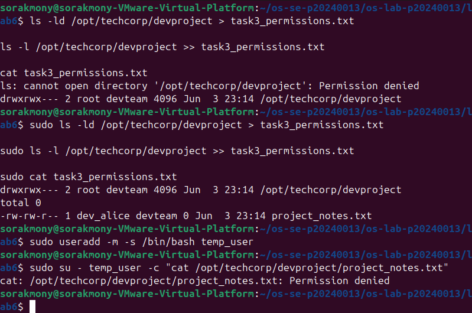

---

### Screenshot 7 — Task 4: setgid Bit
Show the directory listing with `s` in the group execute position, and `bob_file.txt` inheriting the `devteam` group.
<!-- Insert your screenshot below: -->
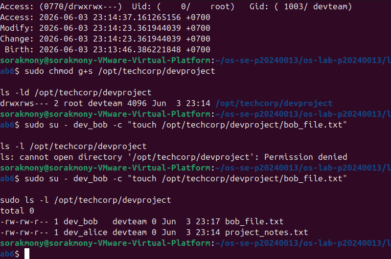

---

### Screenshot 8 — Task 4: Sticky Bit
Show the `t` bit in the directory listing and the `Operation not permitted` error when `dev_bob` tries to delete `dev_alice`'s file.
<!-- Insert your screenshot below: -->
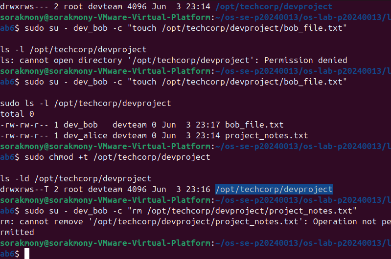

---

### Screenshot 9 — Task 4: setuid Bit
Show `ls -l whoami_suid` with `s` in the owner execute position and the program's UID output.
<!-- Insert your screenshot below: -->
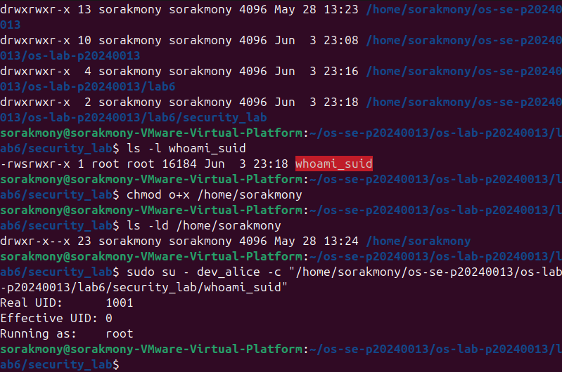

---

### Screenshot 10 — Task 5: ACL Directory
Show `getfacl /opt/techcorp/devproject` with the `auditors` ACE.
<!-- Insert your screenshot below: -->
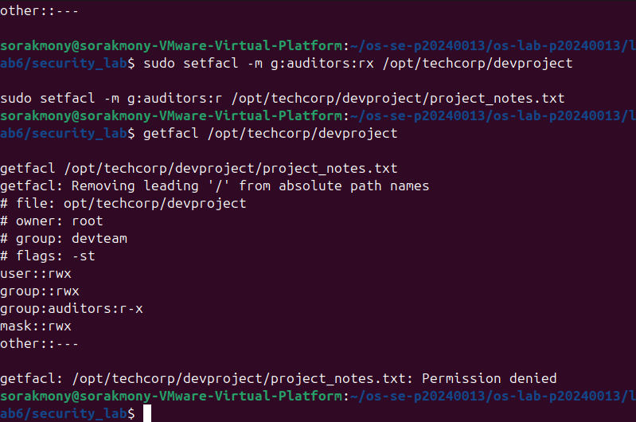

---

### Screenshot 11 — Task 5: ACL Access Test
Show `dev_alice` successfully accessing the file and `temp_user` being denied.
<!-- Insert your screenshot below: -->
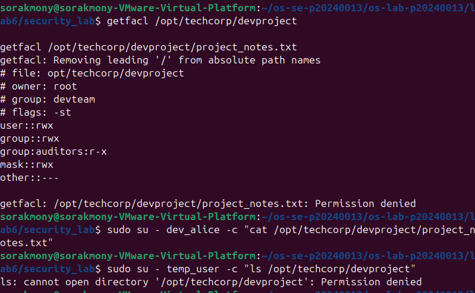

---

### Screenshot 12 — Task 5: ACL Output File
Show `cat task5_acl.txt` with the full ACL entries.
<!-- Insert your screenshot below: -->
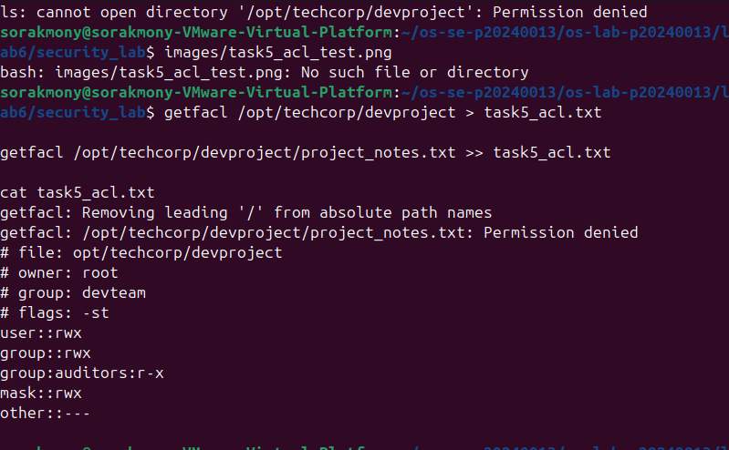

---
### Challenge

---
# Answers to Lab Questions

1. **What is the difference between `userdel` and `userdel -r`?**
   > `userdel` removes only the user account from the system (deletes the entry from `/etc/passwd`, `/etc/shadow`, and `/etc/group`), but leaves the user's home directory and files intact on disk. `userdel -r` does everything `userdel` does plus removes the user's home directory and all its contents, as well as the user's mail spool. Use `-r` when you want a complete cleanup, and plain `userdel` when you need to preserve the user's files for handover or archiving.

2. **Why is it safer to use `visudo` instead of directly editing `/etc/sudoers`?**
   > `visudo` locks the `/etc/sudoers` file to prevent simultaneous edits and, most importantly, validates the syntax before saving. If you introduce a typo or syntax error by editing the file directly with a regular text editor, the entire `sudo` system can break — potentially locking every user out of root access permanently. `visudo` catches the error and gives you a chance to fix it before the bad file is written, making it the only safe way to edit sudoers.

3. **What happens when a `setgid` directory contains files created by different users? What benefit does this provide for team collaboration?**
   > When `setgid` is set on a directory, any new file or subdirectory created inside it automatically inherits the group ownership of the parent directory, regardless of which user created it. So even if `dev_alice` and `dev_bob` have different primary groups, both their files will belong to `devteam`. This is extremely useful for team collaboration because it ensures all shared files are consistently group-owned by the team, allowing all members to read and write them without manual `chown` or `chgrp` every time a new file is created.

4. **What limitation of standard Unix permissions does the ACL system solve?**
   > Standard Unix permissions only allow you to define access for three categories: the file owner, one group, and everyone else. This means you cannot grant a specific permission to a second group or a specific individual user without changing the file's group or making it world-accessible. ACLs solve this by allowing fine-grained, per-user and per-group permission entries on top of the standard permission bits. For example, in this lab we granted the `auditors` group read-only access to the `devproject` directory without changing its primary group away from `devteam`.
