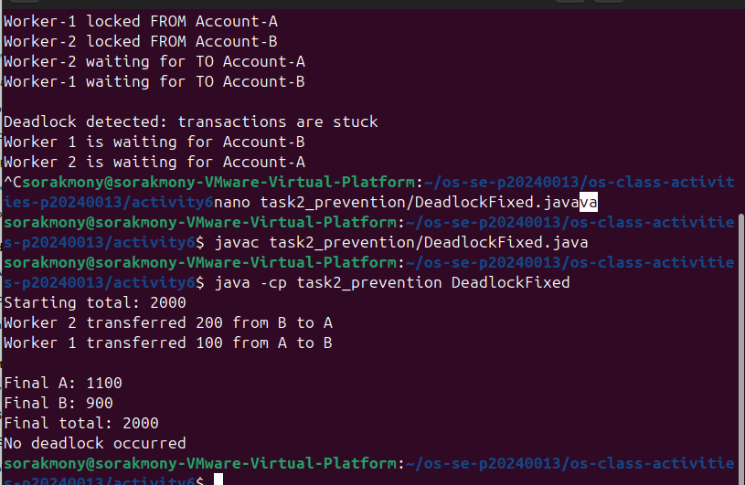
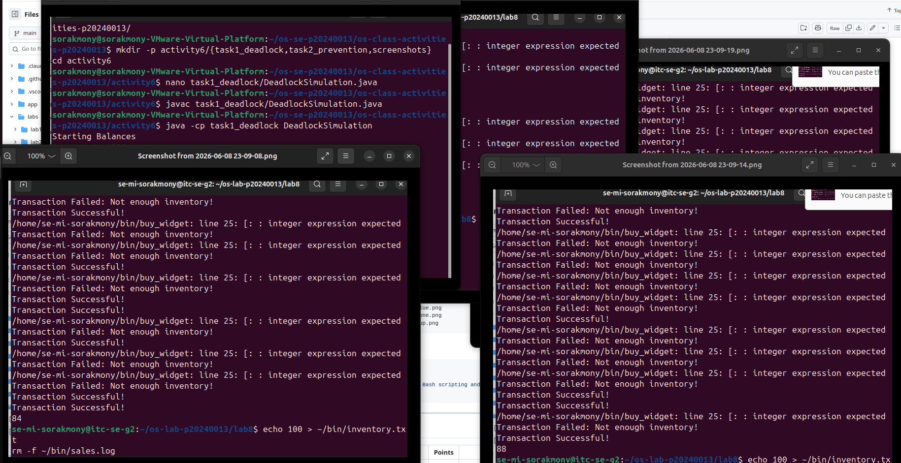
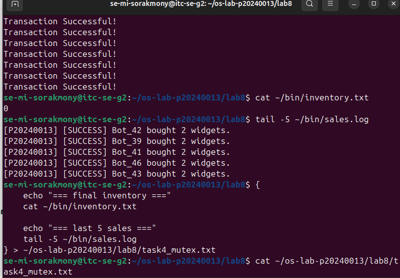
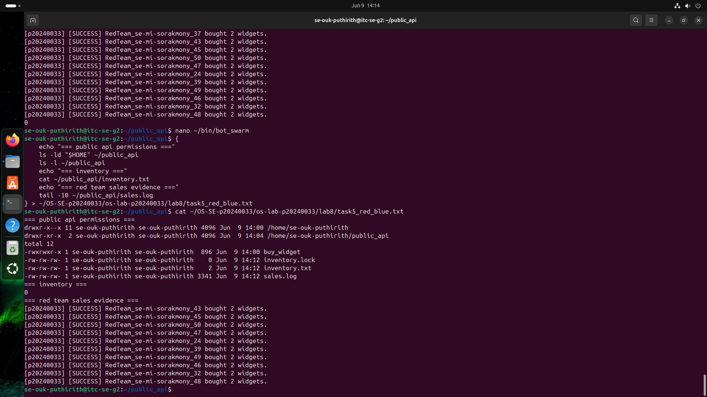
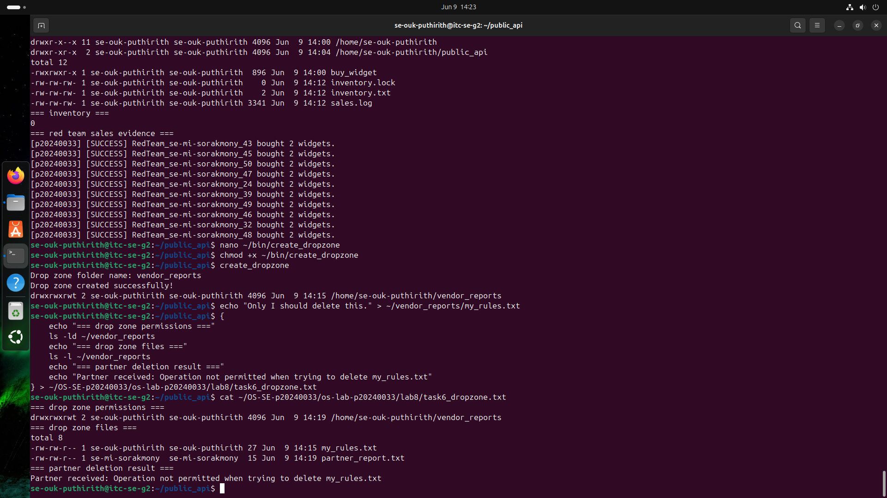
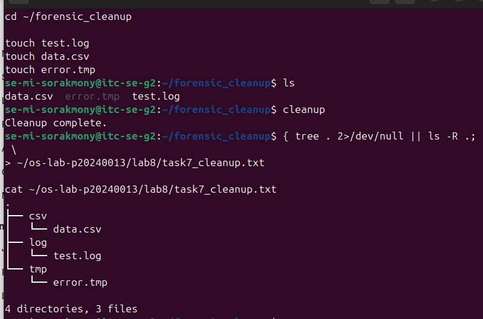

# OS Lab 8 Submission - The Quantum Widget Exploit

* **Student Name:** MI  Sorakmony
* **Student ID:** P20240013
* **Partner Username:** se-ouk-puthirith

---

# Task Output Files

* observations.txt
* task0_warmup.txt
* task1_validation.txt
* task2_audit.txt
* task4_mutex.txt
* task5_red_blue.txt
* task6_dropzone.txt
* task7_cleanup.txt
* scripts/arg_viewer
* scripts/quantum_probe
* scripts/buy_widget
* scripts/bot_swarm
* scripts/create_dropzone
* scripts/cleanup

---

# Screenshots

## Screenshot 1 - Level 0: Bash Warm-Up Scripts

## Screenshot 2 - Level 2: Audit Trails

## Screenshot 3 - Level 4: Mutex Patch

## Screenshot 4 - Level 5: Red Team vs. Blue Team

## Screenshot 5 - Level 6: Secure Drop Zone

## Screenshot 6 - Level 7: Forensic Cleanup

---

# Race Condition Observations

| Run | Final Inventory | Notes                                                                                |
| --- | --------------- | ------------------------------------------------------------------------------------ |
| 1   | 84              | Inventory was higher than expected due to concurrent updates overwriting each other. |
| 2   | 82              | Race condition caused some purchases to be lost.                                     |
| 3   | 86              | Multiple processes read the same inventory value before updates were written.        |
| 4   | 80              | Final inventory varied because process execution order changed.                      |
| 5   | 88              | TOC-TOU vulnerability allowed inconsistent inventory updates.                        |

---

# Answers to Lab Questions

### 1. In arg_viewer, what did $0, $1, $2, $#, and $? mean when you ran the script?

* `$0` = the script name that was executed.
* `$1` = the first command-line argument.
* `$2` = the second command-line argument.
* `$#` = the total number of arguments provided.
* `$?` = the exit status of the previously executed command, where 0 indicates success.

### 2. What does TOC-TOU mean, and where did it appear in the vulnerable buy_widget script?

TOC-TOU stands for **Time-of-Check to Time-of-Use**. It occurs when a program checks a resource and later uses it, allowing another process to modify the resource in between. In the vulnerable buy_widget script, the inventory was read from inventory.txt, checked, and then updated later without synchronization, allowing multiple processes to interfere with each other.

### 3. Why did bot_swarm sometimes leave inventory values other than 0 before the patch?

Multiple instances of buy_widget ran at the same time. Several processes read the same inventory value before any updates were written back. As a result, some inventory changes were overwritten, causing inconsistent final values.

### 4. What part of the script is the critical section, and why must it be protected?

The critical section includes:

* Reading inventory.txt
* Checking available inventory
* Calculating the new inventory value
* Writing the updated value
* Logging the transaction

It must be protected because concurrent processes accessing these operations simultaneously can corrupt shared data.

### 5. How does flock -x enforce mutual exclusion between concurrent processes?

`flock -x` acquires an exclusive lock on a lock file. While one process holds the lock, all other processes must wait until the lock is released. This guarantees that only one process can execute the critical section at a time.

### 6. Which permissions did you use to let a classmate run your API without giving full access to your home directory?

The following permissions were used:

* `chmod o+x "$HOME"` to allow directory traversal.
* `chmod 755 ~/public_api` to allow access to the API folder.
* `chmod o+rx ~/public_api/buy_widget` to allow execution of the script.
* `chmod o+rw inventory.txt sales.log inventory.lock` to allow controlled access to required files.

These permissions exposed only the necessary resources rather than the entire home directory.

### 7. Why does the sticky bit protect files in a shared drop zone?

The sticky bit allows users to create files in a shared writable directory but prevents them from deleting or renaming files owned by other users. This protects user-owned files while still allowing collaboration.

### 8. What defensive scripting practice from this lab would you use in a real production script?

I would use strict input validation and file locking with `flock`. Input validation prevents invalid data from entering the system, while file locking prevents race conditions and data corruption when multiple processes access shared resources.

---

# Reflection

This lab demonstrated how Bash scripts interact with operating system features such as process scheduling, file permissions, and synchronization. I learned that concurrent processes can create race conditions when shared resources are not protected. Using file locks with `flock`, proper permission settings, and the principle of least privilege improves both reliability and security. The lab also showed how operating system scheduling decisions can directly affect application behavior and why secure concurrent access mechanisms are necessary in real-world systems.
