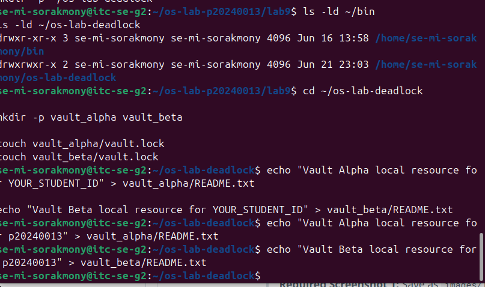
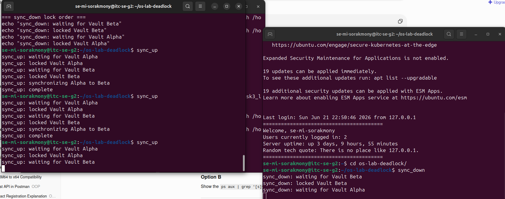
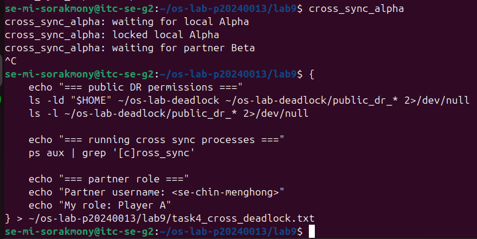
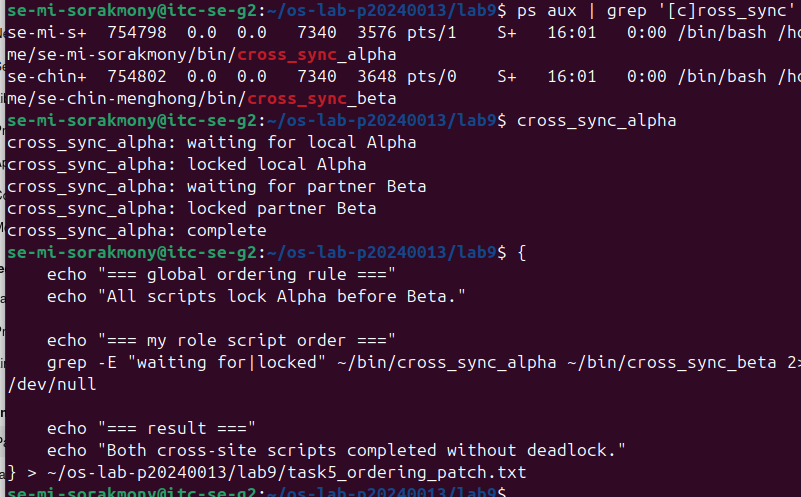
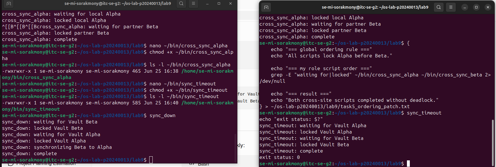
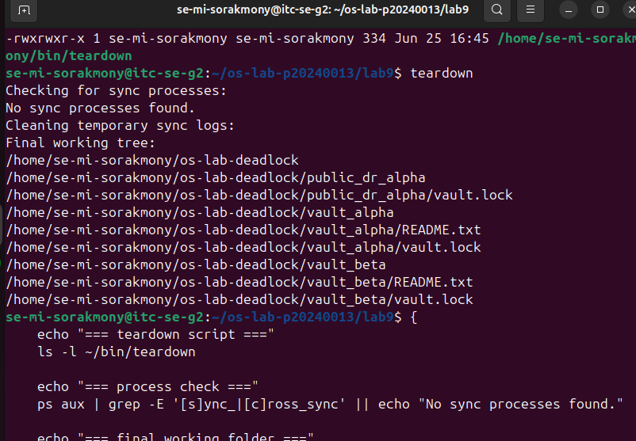

# OS Lab 9 Submission - The Quantum Vault Deadlock

* **Student Name:** p20240013
* **Student ID:** p20240013
* **Linux Username:** se-mi-sorakmony
* **Partner Username:** se-chin-menghong
* **Partner Student ID:** p20240024
* **My Role:** Player A

---

## Required Working Files Outside the Repo

Confirm these files and folders existed while you ran the lab:

* [x] `~/bin/sync_up`
* [x] `~/bin/sync_down`
* [x] `~/bin/sync_timeout`
* [x] `~/bin/teardown`
* [x] `~/bin/cross_sync_alpha`
* [x] `~/os-lab-deadlock/README.md`
* [x] `~/os-lab-deadlock/vault_alpha/README.txt`
* [x] `~/os-lab-deadlock/vault_alpha/vault.lock`
* [x] `~/os-lab-deadlock/vault_beta/README.txt`
* [x] `~/os-lab-deadlock/vault_beta/vault.lock`
* [x] `~/os-lab-deadlock/public_dr_alpha/vault.lock`

---

## Task Output Files

Make sure all of the following files are present in your `lab9/` folder:

* [x] `task1_vaults.txt`
* [x] `task2_sync_scripts.txt`
* [x] `task3_local_deadlock.txt`
* [x] `task4_cross_deadlock.txt`
* [x] `task5_ordering_patch.txt`
* [x] `task6_timeout_recovery.txt`
* [x] `task7_teardown.txt`
* [x] `scripts/sync_up`
* [x] `scripts/sync_down`
* [x] `scripts/sync_timeout`
* [x] `scripts/teardown`
* [x] `scripts/cross_sync_alpha`

---

## Screenshots

### Screenshot 1 - Level 1: Vault Workspace Setup

---

### Screenshot 2 - Level 3: Local Deadlock

---

### Screenshot 3 - Level 4: Site-to-Site Deadlock

---

### Screenshot 4 - Level 5: Global Resource Ordering Patch

---

### Screenshot 5 - Level 6: Timeout Recovery

---

### Screenshot 6 - Level 7: Cleanup and Reset

---

## Deadlock Observation Table

| Level | Script A Held   | Script A Waited For        | Script B Held   | Script B Waited For        | Result      |
| :---: | --------------- | -------------------------- | --------------- | -------------------------- | ----------- |
|   3   | Vault Alpha     | Vault Beta                 | Vault Beta      | Vault Alpha                | Deadlock    |
|   4   | Local Alpha     | Partner Beta               | Local Beta      | Partner Alpha              | Deadlock    |
|   5   | Alpha then Beta | None (eventually acquired) | Alpha then Beta | None (eventually acquired) | No Deadlock |

---

## Answers to Lab Questions

### 1. What does each `vault.lock` file represent in this lab?

Each `vault.lock` file represents a shared resource that can only be used by one process at a time. The lock file is used with `flock` to control exclusive access to a vault resource.

### 2. Why does `flock` require every script to lock the same shared file to coordinate correctly?

`flock` works by locking a specific file. If different scripts lock different files, they will not be aware of each other. All scripts must lock the same shared file so that the operating system can coordinate access correctly.

### 3. In the local deadlock, which resource did `sync_up` hold, and which resource did it wait for?

`sync_up` locked Vault Alpha first. It then waited for Vault Beta, which was already locked by `sync_down`.

### 4. In the local deadlock, which resource did `sync_down` hold, and which resource did it wait for?

`sync_down` locked Vault Beta first. It then waited for Vault Alpha, which was already locked by `sync_up`.

### 5. Which four deadlock conditions were present in Level 3?

The four deadlock conditions were:

1. Mutual Exclusion – only one process could hold a lock at a time.
2. Hold and Wait – each process held one lock while waiting for another.
3. No Preemption – locks could not be forcibly taken away.
4. Circular Wait – each process waited for a resource held by the other process.

### 6. How does the global Alpha-before-Beta ordering rule break circular wait?

The rule forces all processes to request resources in the same order. Since every process locks Alpha before Beta, it is impossible to create a cycle where one process waits for Alpha while another waits for Beta. This removes the circular wait condition.

### 7. Why is `flock -w` useful for recovery even though it does not prevent every deadlock?

`flock -w` limits how long a process waits for a lock. If the lock is not available within the specified time, the process exits with an error instead of hanging forever. This improves recovery and system responsiveness.

### 8. Why should you check for stuck processes before finishing a deadlock lab?

Stuck processes may continue holding locks and consuming resources. Checking for them ensures that all locks are released, the environment is clean, and future tests are not affected by leftover processes.

---

## Reflection

This lab demonstrated how multiple processes compete for shared resources and how improper locking order can create deadlocks. I learned how file locking with `flock` is used for synchronization, how circular wait causes deadlock, and how global resource ordering can prevent deadlock. I also learned that timeout mechanisms such as `flock -w` help recover from lock contention by preventing processes from waiting indefinitely. Overall, the lab provided practical experience with process synchronization, deadlock detection, prevention, and recovery techniques in Linux.
